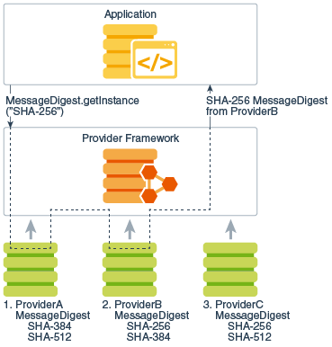

### Java Cryptography Architecture(JCA)
The Java Cryptography Architecture (JCA) is a major piece of the platform, and contains a `"provider" architecture` and a set of APIs for     
digital signatures, message digests (hashes), certificates and certificate validation, encryption (symmetric/asymmetric block/stream ciphers), key generation and management, and secure random number generation, to name a few. 

Security services(security algorithms e.g. AES-GCM) are implemented in providers (see [Cryptographic Service Providers](https://docs.oracle.com/en/java/javase/11/security/java-cryptography-architecture-jca-reference-guide.html#GUID-3E0744CE-6AC7-4A6D-A1F6-6C01199E6920))    
Since the *JCE* uses the same architecture as the JCA, the JCE should be more properly thought of as a part of the JCA.
JCA packages:
- java.security
- javax.crypto
- javax.crypto.spec
- javax.crypto.interfaces

`engine classes`:Algorithm independent classes that represents a *cryptography primitive*, and have a *getInstance(String)* method to specify an algorithm.    
- Cipher
- MessageDigest
- Signature
- KeyPairGenerator
- KeyFactory

`Cryptographic Service Providers`(CSP): implementation of one or more security services(algorithms)    
Each JDK installation has one or more providers installed and configured by default. For example Sun, SunJSSE, SunJCE    
Each CSP contains an Instance of "java.security.Provider" which contains the provider's name and lists all of the security services/algorithms it implements.       

`java.security.spec.KeySpec`: A marker interface, A (transparent) specification of the underlying key material.      
for example PBEKeySpec contains   char[] password; byte[] salt = null; int iterationCount = 0; int keyLength = 0;    
    and PBKDF2HMAC SecretKeyFactory uses it to generate SecretKey.      
for example DSAKeySpec contains BigInteger x; BigInteger p; BigInteger q; BigInteger g;  
    and DSA KeyFactory uses it to generate DSAPrivateKey(which only contains BigInteger X)    

`java.security.Key`: The Key interface is the top-level interface for all keys.      
It defines the functionality shared by all key objects. All keys have three characteristics     
- String algorithm
- byte[] encoded form
  - The key is encoded according to a standard format (e.g. PKCS#8)
- String format
  - returns format that is used for encoding the key    
  - for example the name of the ASN.1 data format for private keys is PrivateKeyInfo, as defined by the PKCS #8 standard.    

`java.security.PrivateKey` and `javax.crypto.SecretKey` are extending this interface.    

### Java Secure Socket Extension (JSSE)
Implementation of TLS and DTLS    

#### SSL Certificate     
Bind public key value to a subject     

SSL certificate types:  
- Single Domain SSL certificate
- Wildcard SSL certificate
- Multi-Domain SSL Certificates (MDC)

SSL certificate validation level:   
- Domain Validation(DV)
- Organization Validation(OV)
- Extended Validation(EV SSL)

X.509 v3 certificates:    
X.509 defines a standard certificate format.    
Certificates are data structures that bind public key values to subjects.   
The binding is asserted by having a trusted CA digitally sign each certificate.    
`Certification Path`: certificate chain, from end-entity certificate(certificate of the public key owner signed by one CA) to root CA certificate(trust anchor)    
Self-signed certificates: are self-issued certificates where the digital signature may be verified by the public key bound into the certificate.     
X.509 also defines `certificate revocation lists`    

### References
- [Oracle JCA doc](https://docs.oracle.com/en/java/javase/11/security/java-cryptography-architecture-jca-reference-guide.html#GUID-2BCFDD85-D533-4E6C-8CE9-29990DEB0190)
- [cloudflare types of SSL](https://www.cloudflare.com/learning/ssl/types-of-ssl-certificates/)
- [RFC5280 X509 standard](https://www.rfc-editor.org/rfc/rfc5280)