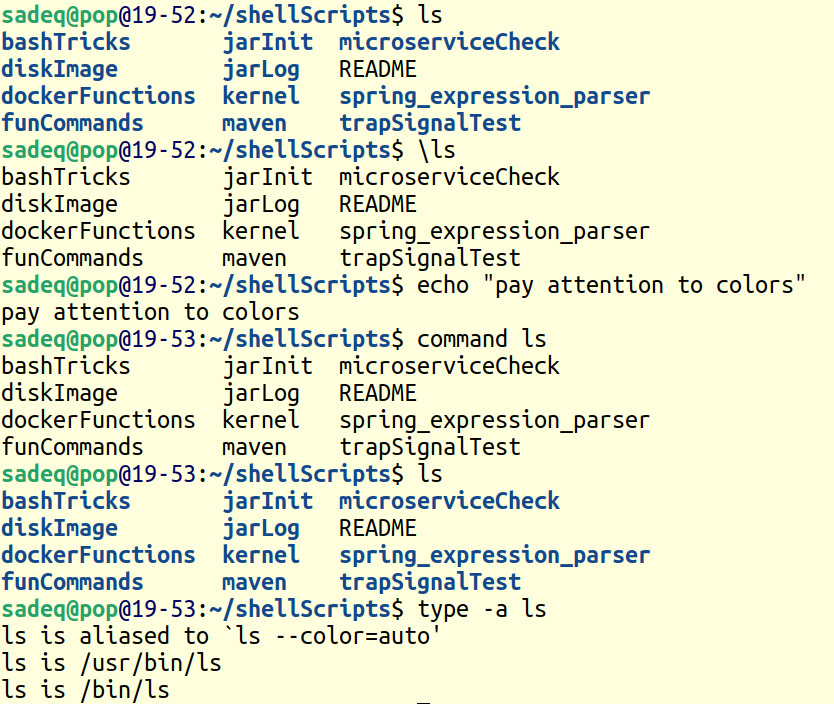

## bash EXPANSION(7s)
- parameter expansion ` ${variable} $var `
- command substitution `` $(command) `command` ``
- tilde expansion ` ~name `
- arithmetic expansion ` $((arithemtic expression)) `
- brace expansion ` {a1,a2} {I1..I2} ` **arg increasing*
- pathname expansion(globbing) ` [chars] * ? ` **arg increasing*
- word splitting(IFS) **arg increasing*

> use " " to prevent *arg increasing*    
## less tricks
to set mark 'a' : ma   
to goto mark 'a' : 'a
## bypass alias
- use built-in command  *command*  ` e.g. command ls `
- use leading \\ ` e.g. \ls `

