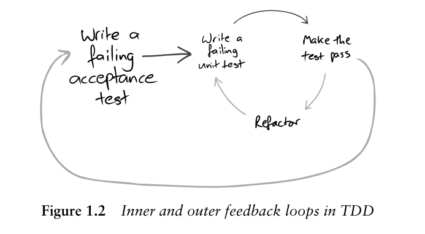
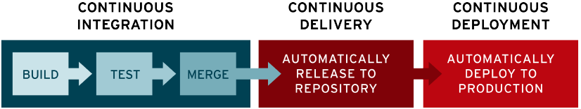
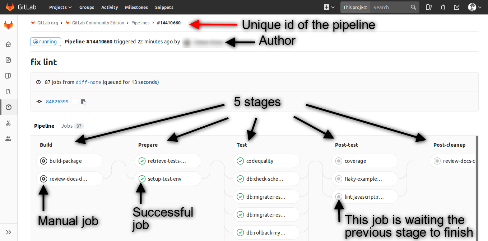
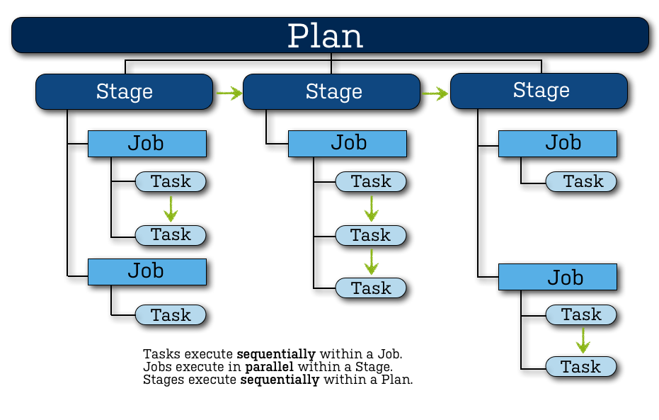

### CI/CD (Continuous Integration and Continuous Delivery)     
CI/CD falls under DevOps (the joining of development and operations teams).     

CI/CD is the critical part of TDD(Test Driven Development) and TDD is a core practice of Extreme Programming (XP) [Kent Beck].      
We’ve used TDD on every agile project we’ve been involved in, and have found uses for it in non-agile projects.     
TDD is an awareness of the gap between decision and feedback during programming, and techniques to control that gap [Kent Beck].     
From TDD *empirical feedback* is a fundamental tool, and Without deployment, the feedback is not complete.    

>Each feedback loop addresses different aspects of the system and development process.     
> The inner loops are more focused on the technical detail: what a unit of code does, whether it integrates with the rest of the system.     
> The outer loops are more focused on the organization and the team: whether the application serves its users’ needs, whether the team is as effective as it could be.    
     
> Failing unit tests should never be committed to the source repository.     
     
CI/CD automates build, test (including integration tests, unit tests, and regression tests), and deploy phases, as well as infrastructure provisioning.     

Continuous Integration: Is the practice of integrating all your code changes into the main branch of a shared source code repository early and often,     
Nowadays, it is typically implemented in such a way that it triggers an automated build with testing.     
- to minimize the possibility of merge conflict     
- to fix bugs early

Continuous Delivery: automate the infrastructure provisioning and application release process.     
CD refers to continuous deployment or continuous delivery, which automates the application's release to its intended environment.



### gitlab Vs Bamboo CI/CD     
To use GitLab CI/CD, you start with a `.gitlab-ci.yml` file at the root of your project which contains the configuration for your CI/CD pipeline.     
Bitbucket's repositories can be linked to bamboo server project in their settings.     
Bamboo agent will create new working directory(build directory) for every job with this scheme `<project key>-<plan key>-<job key>`.    

<table>
        <tr>
            <th>Gitlab CI/CD</th>
            <th>Atlassian Bamboo</th>
            <th>Description</th>
        </tr>
        <tbody>
        <tr>
            <td>pipeline</td>
            <td>plan</td>
            <td>defines every thing about your continuous integration build process</td>
        </tr>
        <tr>
            <td>Runner</td>
            <td>Bamboo agent</td>
            <td>agents that run jobs</td>
        </tr>
        <tr>
            <td>stage</td>
            <td>stage</td>
            <td>Stage group jobs and represents individual step in build process(e.g. Typical stages might be build(compile), test, and deploy.).    
                Processes its jobs in parallel, on multiple agents (where available).     
                Must successfully complete all its jobs before the next stage </td>
        </tr>
        <tr>
            <td></td>
            <td></td>
        </tr>
        </tbody>

</table>

### Database DevOps
To integrate database changes into CI/CD workflow, use database change as code.    
Liquibase is a database schema change management solution, Treating database change as code.     
Liquibase track database changes in specialized scripts: `changelog`(migration script)    
Changelog file contains sequence of `changesets`    
changeset is an atomic unit of change in changelog file.    
When you want to modify your database, simply add a new changeset and specify its operation as a `Change Type`.    
Your changelogs can be written in the SQL, XML, YAML, or JSON formats.    

> Liquibase uses the DATABASECHANGELOG table to keep track of which changes it has already deployed.      
> In Liquibase 4.27.0 and later, Liquibase also records additional migration information in the DATABASECHANGELOGHISTORY table.

A sample changelog:   
```xml
<?xml version="1.0" encoding="UTF-8"?>
<databaseChangeLog
        xmlns="http://www.liquibase.org/xml/ns/dbchangelog"
        xmlns:xsi="http://www.w3.org/2001/XMLSchema-instance"
        xsi:schemaLocation="http://www.liquibase.org/xml/ns/dbchangelog
                      http://www.liquibase.org/xml/ns/dbchangelog/dbchangelog-4.29.xsd"
        objectQuotingStrategy="QUOTE_ONLY_RESERVED_WORDS">
    <changeSet id="1744614839412-1" author="Sadeq Safdari">
        <createTable tableName="breed">
            <column autoIncrement="true" name="id" type="INT">
                <constraints nullable="false" primaryKey="true" primaryKeyName="pk_breed"/>
            </column>
            <column name="name" type="VARCHAR(255)"/>
            <column name="breed_type_id" type="INT"/>
        </createTable>
    </changeSet>
</databaseChangeLog>
```
Liquibase is written by Java, you can install its CLI on your OS.     
```bash
dnf5 config-manager addrepo --from-repofile=https://repo.liquibase.com/repo-liquibase-com.repo
```
Changelog is the core of your Liquibase project,    
It is recommended to have multiple changelog files and link them with *include* tag.    
Log in changelog refers to `Log pattern`, described as append-only sequence of immutable changesets.     
Therefor to update a changeset, you should write a new changeset instead of updating that changeset.    


### References
- [gitlab ci-cd doc](https://about.gitlab.com/topics/ci-cd/)
- [redhat ci-cd doc](https://www.redhat.com/en/topics/devops/what-is-ci-cd)
- [bamboo ci-cd doc](https://confluence.atlassian.com/bamboo/configuring-plans-289276853.html)
- [Liquibase doc](https://docs.liquibase.com/concepts/changelogs/home.html)
- [Liquibase update changeset](https://www.liquibase.com/blog/dealing-with-changing-changesets)
- [GOOS book](https://www.amazon.com/Growing-Object-Oriented-Software-Guided-Tests/dp/0321503627)