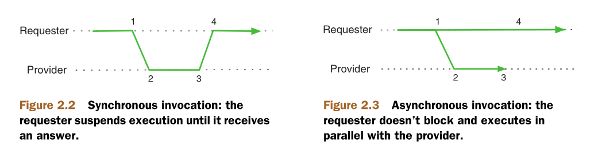

### Enterprise Integration patterns    
- Pipes-and-Filters architectural style   

When we design and build a software application, we strive to provide a foundation that accurately models the application’s domain.      
The domain is like a slice of reality that has particular relevance from the perspective of a given business.     
Therefore, successful software projects are accurate reflections of the real world, and as such, the event-driven nature plays an increasingly important role.   

Reducing coupling is one of the main concerns when integrating applications.    
this can be done by eliminating assumptions about the concrete types used in the application as well as replacing method and web service invocations with message passing.    
With respect to the latter, we mentioned synchronous communication as a way to increase the coupling of two systems.       

**Synchronous and asynchronous communication**     
Synchronous communication mandates multiple integrated components available simultaneously.     
     
Synchronous communication main weaknesses are that it’s not scalable, and it’s less resilient to failure.    
Scaling up is a problem for synchronous communication because if the number of simultaneous requests increases, the target component has few alternatives, for example:   
- Trying to accommodate all requests as they arrive, which will crash the system.     
- Throttling some requests to bring the load to a bearable level.    

When the load increases, the application will eventually fail, and you can do little about it.    
Asynchronous communication offers better opportunities to organize the work on the service provider’s side.     
Requests aren’t processed immediately but left in an intermediate storage(**buffer**) and from there are delivered to the service provider whenever it can handle them.    

asynchronous communication weaknesses is the retrieval of the result(service provider result) is a more complex matter.    
asynchronous communication by its nature is message-driven whereas synchronous communication is service-interface.

### 4 major enterprise integration styles    
- File-based integration
- Shared-database integration
- Remote Procedure Calls(RPC)    
    - synchronous communication
    - point-to-point communication(P2P)
>**CRUD over HTTP is a degenerate kind of RPC**    
> The best RPC implementations aim to be protocol agnostic
- Message-based integration
    - asynchronous communication (i.e. request proceeds with no wait for response/reply)
    - reduce system-level coupling
    - suitable for big data , high throughput data , chain of requests between microservices
    - point-to-point and point-to-multiPoint communication(P2P & P2MP)

### Event-Driven Architecture(EDA)     
Event-driven architecture (EDA) is a software design pattern that enables the construction of scalable and loosely coupled systems.      
EDA is often implemented through the use of other important software patterns such as microservices and event-driven programming (EDP), coupled together with event processing technologies such as Apache Kafka.     
Event-driven programming is software code-level paradigm where a program’s key value-add functions or business logic are invoked in response to incoming events; the program responds to events as they occur.     
Events representing occurrences or changes in the system drive the flow.     
EDA benefits include scalability, loose coupling, and independent development and deployment of system components. It handles complex workflows, event-driven integrations, and real-time event processing.    

### References
- [confluent EDA](https://www.confluent.io/learn/event-driven-architecture/)
- spring integration in action book