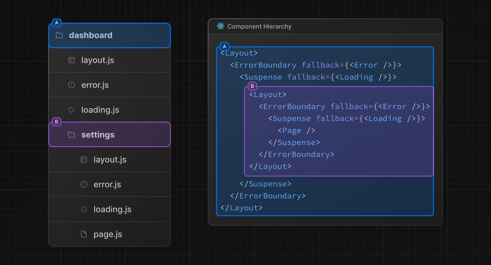

## App router and Pages router
Next.js uses a file-system based router where directories are used to define URL path.      
By default, components inside app directory are `React Server Components`.    
and by Next.js special file convention, a directory's UI is rendered as a hierarchy of components:
```
parent directory layout.js   
    parent directory template.js 
        parent directory error, loading, not-found  
            layout.js
                template.js
                    error.js react boundary
                        loading.js react suspense boundary
                            not-found.js react error boundary
                                page.js
                            
```

> Next.js uses a file-system based router where folders are used to define routes.     
> A special page.js file is used to make route segments publicly accessible.     
> A layout file to show UI that is shared across multiple routes.

In Contrary to Pages router, random files are not accessible in the app directory tree.     
`layout.js`:      
> A layout is UI that is shared between multiple routes.      
> On navigation, layouts preserve state, remain interactive, and do not re-render.      

`template.js`:     
> Templates are similar to layouts in that they wrap a child layout or page.       
> Unlike layouts that persist across routes and maintain state, templates create a new instance for each of their children on navigation.   


## Server-side Rendering (SSR)    
SSR is a part of the Pages router doc.     
If a page uses Server-side Rendering, the page HTML is generated on each request.    
Component function props is populated by an async function called **getServerSideProps** which is invoked for every HTTP request.     

SSR, **series of blocking steps** :
- First, all data for a given page is fetched on the server.
- The server then renders the HTML for the page.
- The HTML, CSS, and JavaScript for the page are sent to the client.
- A non-interactive user interface is shown using the generated HTML, and CSS.
- Finally, React hydrates the user interface to make it interactive.

[SSR without streaming](./server-rendering-without-streaming-chart.avif)   

Use `<Suspense>` component for Streaming Server Rendering    

## Static Site Generation(SSG)
SSG is a part of Nextjs Pages router doc.     
If a page uses Static Generation, the page HTML is generated at build time.       
That means in production, the page HTML is generated when you run `next build`.       
This HTML will then be reused on each request. It can be cached by a CDN.     

Static Generation is not a good idea if you cannot pre-render a page ahead of a user's request.    

## Client-side Rendering (CSR)   
CSR is a part of the Pages router doc.     
> In Client-Side Rendering (CSR) with React, the browser downloads a minimal HTML page and the JavaScript needed for the page.        
> The JavaScript is then used to update the DOM and render the page.       
> When the application is first loaded, the user may notice a slight delay before they can see the full page, this is because the page isn't fully rendered until all the JavaScript is downloaded, parsed, and executed.    

## React Server Components     
React Server Components are rendered in **server environment**, meaning its code is executed by node.js in contrast to browser.          
> React Server Components allow you to write UI that can be rendered and optionally cached on the server.     

There are three different server rendering strategies:     
- `Static Rendering`(render at build time, SSG): Server Components without a WebServer
- `Dynamic Rendering`(render at request time, SSR): Server Components with a WebServer
- `Streaming`

React Server Components can be an **async** function.    
React Server Components can not use React Hooks and Web APIs(e.g. HTML event listeners).    

From Next.js 13 onward Any component which has 'use client' at the top of the file is identified as a Client Component.       
If we don't specify that at the top of the file, the component in the file is considered a Server Component.     

> By default, Server Components are automatically code split,     
> and you can use streaming to progressively send pieces of UI from the server to the client.     
> Lazy loading applies to Client Components.     
> When using React.lazy() and Suspense, Client Components will be prerendered(SSR) by default.

## data fetching and caching
basic server-side data fetch using the `fetch` API in an asynchronous React Server Component.
> If you are not using any dynamic functions anywhere else in this route,       
> React Server Component will be prerendered during next build to a static page.       
> The data can then be updated using Incremental Static Regeneration.

If you do not want to cache the response from fetch, you can do the following:    
```jsx
let data = await fetch('https://api.vercel.app/blog', { cache: 'no-store' });
```
Client(browser) data fetching ways:     
- useEffect alongside useState
- SWR
- React Query(TanStack Query)  

Why not using the effect hook for data fetching?     
- handle concurrent setup function execution
    - > network responses may arrive in a different order than you sent them.
- handle loading and error state

## React Query
React Query(TanStack Query) is more than a data fetching library, it makes **fetching**, **caching**, **synchronizing and updating server state** in your web applications a breeze.     
The older docs describe it is as an **async state manager** that is also acutely aware of the needs of server state.      
React Query uses Hierarchical Key/Value as a caching strategy.    
> In React Query terms, stale is the opposite of fresh.      
> As long as a query is considered fresh, data will only be delivered from the cache.       
> And staleTime is what defines the time (in milliseconds) until a query is considered stale.     

By default, `staleTime` is 0.     
When data "isStale: true" after re-render data is delivered straight from the cache then react-query resynchronizes in the background and updates the cache.      
Stale queries are refetched automatically in the background when:
- New instances of the query mount(not just a component rerender)
- The window is refocused
- The network is reconnected
- The query is optionally configured with a refetch interval
 
`useQuery` will create a subscription.     
```tsx
const {data} = useQuery({
  queryKey: ['userData'], // used as cache key
  queryFn: () => fetch("URL").then(res => res.json())
});
```
To forcibly re-fetch data, `invalidateQueries` or `refetchQueries` methods can be used 
```tsx
queryClient.invalidateQueries({queryKey: ['userData']});
queryClient.refetchQueries({queryKey: ['userData']});
```
## References
- [define route](https://nextjs.org/docs/app/building-your-application/routing/defining-routes)
- [app router](https://nextjs.org/docs/app/building-your-application/routing)
- [React Server Components](https://react.dev/reference/rsc/server-components)
- [Next.js streaming and loading UI](https://nextjs.org/docs/app/building-your-application/routing/loading-ui-and-streaming)
- [Next.js caching](https://nextjs.org/docs/app/building-your-application/data-fetching/fetching)
- [React Query docs](https://ui.dev/c/query)
- [react-query data-synchronization](https://ui.dev/c/query/data-synchronization)
- [TanStack react-query quick-start](https://tanstack.com/query/latest/docs/framework/react/quick-start)
- [TanStack query invalidation](https://tanstack.com/query/latest/docs/framework/react/guides/query-invalidation)