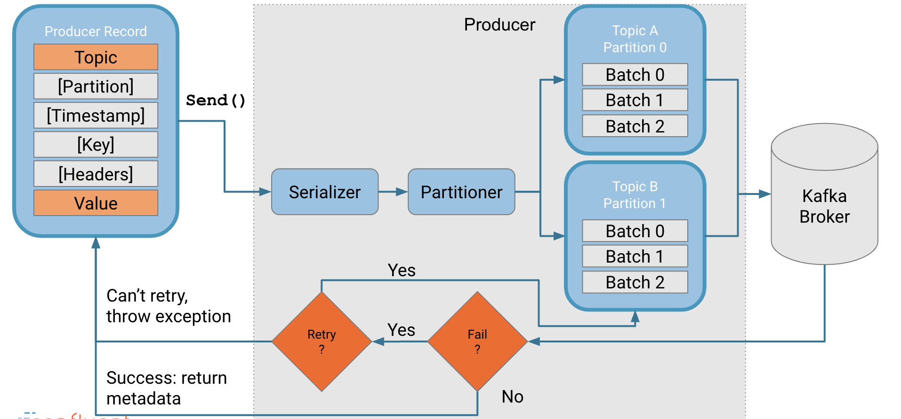
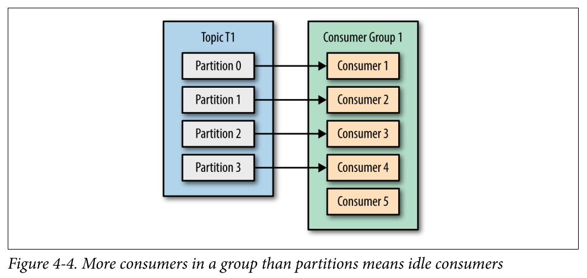
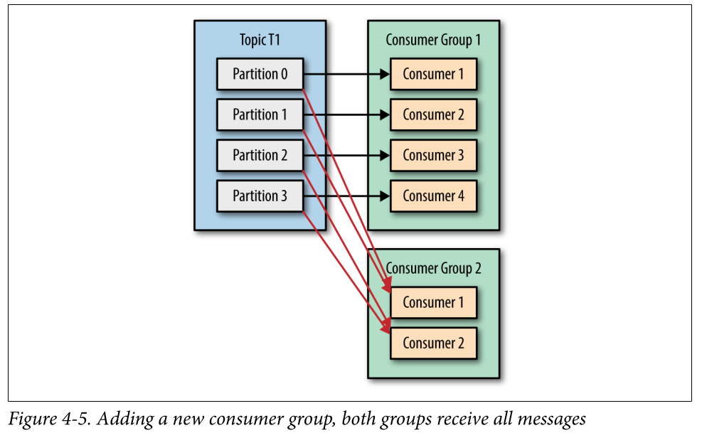
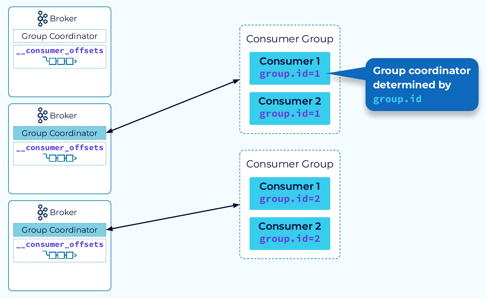

### queue and topic     
Topics (also known as Event streams) are durable and partitioned, and they can be read by multiple consumers as many times as necessary. They are often used to communicate state and to provide a replayable source of truth for consumers.
Queues are usually unpartitioned and are frequently used as an input buffer for work that needs to be done. Usually, each message in a queue is dequeued, processed, and deleted by a single consumer.    

One of main use cases of queue is `task distribution`:    
> The main idea behind Work Queues (aka: Task Queues) is to avoid doing a resource-intensive task immediately and having to wait for it to complete. Instead we schedule the task to be done later.     
> We encapsulate a task as a message and send it to a queue.

### event stream    
Streaming data means a constant(continuous) flow of data,  Streaming data is processed in real-time as it’s delivered to a system.     
Generally speaking, an Event Stream records the history of what has happened in the world as a sequence of events (think: a sequence of facts)     
Streaming data is unbounded, meaning it has no real beginning and no real end—each event is processed as it occurs and managed accordingly.     
This is in contrast to legacy approaches(batch processing), where, by default, data is sent to a backend data warehouse or `Hadoop` cluster to be analyzed every day, week, month, or quarter.    

### kafka producer
- retry sending on transient errors automatically(e.g. LeaderNotAvailableException)    
control the sending retry by **time**(recommended, through delivery.timeout.ms parameter) or **number**    
retry mechanism introduces `duplicate events` and may result in events being delivered out of order.    
Consider using an idempotent producer to mitigate these potential issues.    
- send events in batches    
control the producer buffer behaviour by time(linger.ms) or size(batch.size)

The Kafka producer is conceptually much simpler than the consumer since it has no need for **group coordination**.    
A producer partitioner maps each message to a topic partition, and the producer sends a produce request to the leader of that partition.     
The partitioners shipped with Kafka guarantee that all messages with the same non-empty key will be sent to the same partition.    

> When all in-sync replicas have acknowledged the write, then the message is considered committed, which makes it available for reading.   

    

### AMQP 0-9-1 producer
- **fire-and-forget** by default    
consider enabling a `publisher confirms` protocol extension          
In order to guarantee persistence, a client should use confirms.    
> A transactional channel cannot be put into confirm mode and once a channel is in confirm mode, it cannot be made transactional.

- support persistent(write to disk) and transient messages     
consider using `Delivery mode` header    

- publish a single message through `basic.publish` operation    
AMQP 0-9-1 protocol itself does not inherently support message batching in a single network round trip.      
Each call to the `basic.publish` method sends a single message to the broker.

In AMQP 0-9-1, publishing happens on a channel to an exchange.       
The exchange uses a routing topology set up by defining bindings between one or more queues and the exchange, or source exchange and destination exchange.       
Successfully routed messages are stored in queues.    

    

### Kafka Consumers    
The Kafka consumer works by issuing “fetch”(poll) requests to the brokers leading the partitions it wants to consume.    
Kafka consumers are typically part of a `consumer group`.    
you create a new consumer group for each application that needs all the messages from one or more topics.     

    
   

Each consumer in consumer group owns zero to more partitions and coordination service manages the ownership.    
**partition rebalance**: Moving partition ownership from one consumer to another is called a rebalance.    
There are two types of rebalances, depending on the partition assignment strategy that the consumer group uses:    
- Eager Rebalances    
Eager rebalance revokes all partitions, pauses consumption and re-assigns them.     
- Cooperative Rebalances (incremental rebalances)     
> initially the consumer group leader informs all the consumers that they will lose ownership of a subset of their partitions,     
> the consumers stop consuming from these partitions and give up their ownership in them.     
> At the second phase, the consumer group leader assigns these now orphaned partitions to their new owners.      
> This incremental approach may take a few iterations until a stable partition assignment is achieved,     
> but it avoids the complete “stop the world” unavailability that occurs with the eager approach.    

**Group Coordinator**     
The way consumers maintain membership in a consumer group and ownership of the partitions assigned to them is by sending heartbeats to a Kafka broker designated as the group coordinator.    

> When a consumer instance starts up it sends a FindCoordinator request that includes its group.id to any broker in the cluster.     
> The broker will create a hash of the group.id and modulo that against the number of partitions in the internal __consumer_offsets topic.      
> That determines the partition that all metadata events for this group will be written to.     
> The broker that hosts the leader replica for that partition will take on the role of group coordinator for the new consumer group.     
> The broker that received the FindCoordinator request will respond with the endpoint of the group coordinator.     

**poll-based consumer**    
The same way that sharks must keep moving, or they die, consumers must keep polling Kafka, or they will be considered dead(determined by max.poll.interval.ms).        
If a rebalance is triggered, it will be handled inside the poll loop as well, including related callbacks.    
if poll() is not invoked for longer than max.poll.interval.ms, the consumer will be considered dead and evicted from the consumer group. 
in case of `static membership`, rebalance will be triggered after session.timeout.ms

**consumer auto-commit**    
action of updating the current position in the partition a commit.    
enable.auto.commit controls whether the consumer will commit offsets automatically(at intervals determined by auto.commit.interval.ms), and defaults to true.
### References
- [vmware event stream](https://tanzu.vmware.com/event-streaming)
- [confluent event stream](https://developer.confluent.io/patterns/event-stream/event-stream/)
- [confluent kraft](https://developer.confluent.io/learn/kraft/)
- kafka: The Definitive Guide 
- [confluent kafka producer](https://docs.confluent.io/platform/current/clients/producer.html)
- [rabbitMQ publisher confirms](https://www.rabbitmq.com/confirms.html)
- [confluent kafka consumer](https://developer.confluent.io/courses/architecture/consumer-group-protocol/)