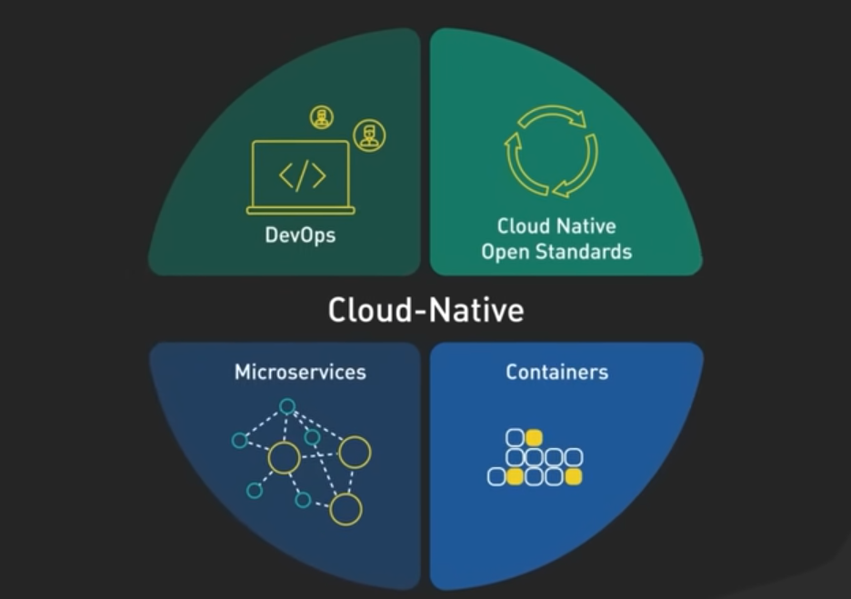

## Microservice patterns and architecture
This document aims to provide an overview of general Microservice architecture patterns.      
General Microservice patterns:    
- Config server
- Discovery service
- Circuit breaker
- API Gateway
- Distributed tracing

## Microservice vs Monolith
A monolithic application built and delivered as a single unit. according to "Spring Microservices in Action" book: 
> All the UI (user interface), business, and database access logic are packaged together into a single application artifact    
> and deployed to an application server.    

**Which architecture should be used when writing an application from scratch: monolith or microservice?**
Martin Fowler believe in `monolith-first strategy`,    
you shouldn't start a new project with microservices, even if you're sure your application will be big enough to make it worthwhile.     
His reasons are:    
- to prioritize speed over scalability.
- to gain a better understanding of the domain and its boundaries.

There are different ways to execute a monolith-first strategy:    
- modular monolith 
    - > The logical way is to design a monolith carefully, paying attention to modularity within the software, both at the API boundaries and how the data is stored.
- start with a monolith and gradually peel off microservices at the edges.
- start with just a couple of coarse-grained services.    

In the context of modular monolith, module represents a sub-package in the main package. it has defined set of exposed APIs and required dependencies.

and shift to microservice architecture when complexity arises and monolithic application became big ball of mud.    

But there are also counter arguments that states:    
> starting with microservices allows you to get used to the rhythm of developing in a microservice environment.     
> It takes a lot, perhaps too much, discipline to build a monolith in a sufficiently modular way that it can be broken down into microservices easily.    

additionally, Microservices’ main benefit, is enabling parallel development by establishing a hard-to-cross boundary between different parts of the system.     
In theory, Microservice architecture is not necessary if Modular Monolith with enforced clear boundaries is viable.    
In practice, establishing clear boundaries in Monolithic application is very hard and the parts will become extremely tightly coupled to each other. 

---
Some approaches help to adopt microservice architecture easily:
- DDD aggregate pattern
    - first structure the business logic as an object model(domain model)[^2]
    - then structuring a domain model as a set of aggregates and make the boundaries explicit.
- Event-Driven Architecture(EDA from Enterprise Integration Patterns)
- CI/CD
- monitoring using Grafana and Prometheus

---
Martin Fowler define a microservice *architectural style*[^1] as follows:
> In short, the microservice architectural style is an approach to developing a single application as a suite of small services,     
> each running in its own process and communicating with lightweight mechanisms, often an HTTP resource API.      
> These services are built around business capabilities and independently deployable by fully automated deployment machinery.     
> There is a bare minimum of centralized management of these services, which may be written in different programming languages and use different data storage technologies.    

Characteristics of microservice architecture:
- Componentization via Services
    - **Component** definition: component is a unit of software that is independently replaceable and upgradeable.   
    - two form of components are *library* and *service*.
    - Components are a form of module, with the additional property of independent replacement.
- Organized around Business Capabilities
    - each microservice should represent one specific **business domain**     
    - Consequently the teams are cross-functional, including the full range of skills required for the development: user-experience, database, and project management.     
    
### Cloud native applications    
Cloud Computing:   
- cloud is a technology resource management system
- Cloud computing is the on-demand availability of computing resources
- based on Virtualization

More applications are being deployed to the cloud(because of cost management) so write the application `cloud native` from the beginning.    
A cloud-native application is specifically designed from the ground up to take advantage of the elasticity and distributed nature of the cloud.    
Cloud-native applications are typically broken down into multiple, self-contained services through the use of technologies and methodologies, namely DevOps, continuous delivery and continuous integration, containers, microservices, and declarative APIs.
“cloud native” isn’t solely about cloud adoption. Instead, it refers to how applications are built and delivered, rather than just where they are deployed.     

### Distributed Systems (From Designing Data-Intensive Applications book)
network of interconnected nodes is called distributed system.    
By distributed systems, we are trying to achieve these goals:    
- Reliability
  - preventing a fault to become a failure(fault-tolerant/resilient)
  - solution: replica/redundancy
  - Fault-tolerant microservices adopt these patterns: circuit breaker, fallback, bulkhead
- Scalability
  - system’s ability to cope with increased load.
  - In online systems, performance is typically measured as `response time` expressed in percentiles (e.g., the 50th percentile, or median, should be below 200ms).
  - solution: horizontal scaling 
- Maintainability
  - codes should be understandable and easy to modify
  - A software project mired in complexity is described as a `big ball of mud`
  - solution: TDD, abstraction to hide complexity
  - operability: making routine tasks easy.
  - solution: monitoring, CI/CD

### SQL or NoSQL (From Designing Data-Intensive Applications book)
`Data models` determine how we think about the problem.    
In Object-Oriented Programming we model **real-world problem concepts** in terms of Objects     
 then it is object model(encapsulating both data (properties) and behavior (methods)).
General-purpose data models:    
- JSON or XML documents
- tables in a relational database
- graph model

General-purpose data models are used to persist(store) the data.    
*NoSQL* was originally intended simply as a catchy Twitter hashtag   
 for a meetup on open source, distributed, nonrelational databases in 2009.    

There are several driving forces behind the adoption of NoSQL databases, including:
- A need for greater scalability than relational databases can easily achieve,      
  including very large datasets or very high write throughput
- Frustration with the restrictiveness of relational schemas, and a desire for a more
  dynamic and expressive data model

To implement one-to-many relationship in SQL we need to `normalize data`.     
`Database normalization` is a relational design to structuring data in a way that      
 reduces redundancy(duplicate data) and preserves data integrity(consistent data),      
 through a set of rules called **normal forms**.    
In normalization, the data is divided into several tables linked together with *foreign keys*.   
consistent data means an entity info should be the same on every place.     
normal form rules:    
- 1NF
  - A column contains only An atomic, indivisible value(no lists, sets, or composite fields).
  - Each row is unique (typically enforced by a primary key).
- 2NF: complying with 1NF and also
  - has no partial dependency. That is, all non-key attributes are fully dependent on a primary key.
    by updating one entity, it shouldn't be necessary to update other entities(tables). 
- 3NF: complying with 2NF and also
  - no transitive dependencies

NoSQL refers to non-relational databases and consist of document-model, graph-model, key-value.   

Document model advantages:    
- schema flexibility
  - arbitrary key and value can be persisted. then better `schema evolution`
  - in relation model, A `migration script` should be written for schema change
- better locality
  - all the relevant information is in one place, and one query is sufficient.

Document model drawbacks:
- weak join support
  - denormalized data(duplicate and inconsistent data possibility), duplicate data means hard updating.
  - not acceptable with highly interconnected data(many-to-many relations)

> For highly interconnected data, the document model is awkward, the relational model is acceptable,
> and graph models are the most natural.

> If data is split across multiple tables,
> multiple index lookups are required to retrieve it all, 
> which may require more disk seeks and take more time.

**Relational model query optimizer**

### API Gateway(Service Gateway,edge service)
**Central entrypoint** to microservices' cluster.    
central means that `cross-cutting service concerns` can be carried out in a single place without the    
individual development teams having to implement those concerns.     
service gateway is a `reverse proxy` to reach microservices' instances, acts as a single **Policy Enforcement Point**(PEP).    

Using a common library instead of separate gateway service has these drawbacks:    
- possibility of dependency hell by transitive dependencies of common library
- update and redeploy each microservice on every single change on cross-cutting concerns

API Gateway is using **predicates** and **filters** to route(proxy) requests.     
Filters are used to enforce a consistent set of policies like security, logging. These policies are considered `cross-cutting concerns`.     
practical filters would be:   
- Pre-filter that adds **Correlation ID** header on each request(if not present) to trace user transaction flow

### Event-Driven Architecture(EDA)
> An Event-Driven Consumer is an object that is invoked by the messaging system when a message arrives on the consumer’s channel.    
> The consumer passes the message to the application through a callback in the application’s API.
>
> Event-Driven Consumers automatically consume messages as they become available.    
> For more fine-grained control of the consumption rate, use a Polling Consumer (494).     

Spring’s journey on Data Integration started with Spring Integration. With its programming model, it provided a consistent developer experience to build applications that can embrace Enterprise Integration Patterns to connect with external systems such as, databases, message brokers, and among others.      
To extend this to Data Integration workloads, Spring Integration and Spring Boot were put together into a new project. **Spring Cloud Stream** was born.    

Spring Cloud Stream allows us to abstract away the implementation details of the messaging middleware that we’re using.

### References
- [Martin Fowler microservice architectural style](https://martinfowler.com/articles/microservices.html)
- [Spring Microservices in Action, Second Edition](https://www.amazon.com/Spring-Microservices-Action-Second-Carnell/dp/1617296953/)
- [Microservice Patterns, written by Chris Richardson](https://www.amazon.com/Microservices-Patterns-examples-Chris-Richardson/dp/1617294543)
- [Martin Fowler, monolith-first strategy](https://martinfowler.com/bliki/MonolithFirst.html)
- [Martin Fowler,don't start monolith](https://martinfowler.com/articles/dont-start-monolith.html)
- [Martin Fowler component definition](https://martinfowler.com/bliki/SoftwareComponent.html)
- [Martin Fowler architecture](https://martinfowler.com/architecture/)
- [Designing Data-Intensive Applications book](https://www.oreilly.com/library/view/designing-data-intensive-applications/9781491903063/)
- [database normalization](https://www.digitalocean.com/community/tutorials/database-normalization#introduction)

[^1]: architectural style(aka architectural pattern): from Martin Fowler point of view architecture is an important design. and from microservice patterns book    
      an application’s architecture is its decomposition into parts (the elements) and the relationships (the relations) between those parts.    
      architectural style like building architecture, defines a family of such systems in terms of a pattern of structural organization.     

[^2]: domain model pattern: Organize the business logic as an object model consisting of classes that have state
     and behavior.These classes typically correspond directly to concepts from the problem domain.(microservice patterns book)