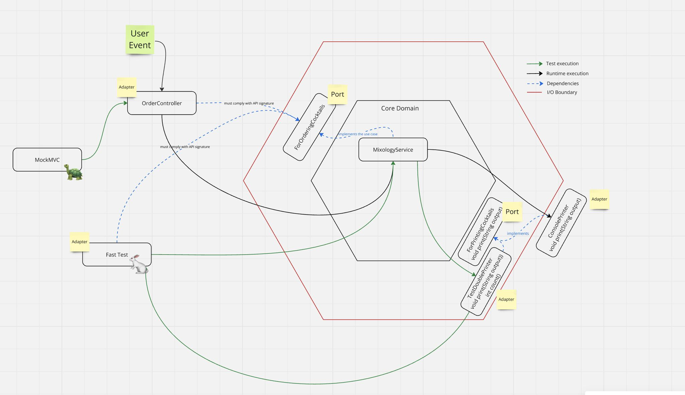

### Ports and Adapters architecture

Ports and Adapters architecture(aka Hexagonal architecture) coined by Dr. Alister Cockburn.    
This architecture main idea is to separate `business domain` from its dependencies on `technical infrastructure`.    
As GOOS book clearly defines this architecture:     
> The code for the business domain is isolated from its dependencies on technical infrastructure, such as databases and user interfaces.    
>We don’t want technical concepts to leak into the application model,    
>so we write interfaces to describe its relationships with the outside world in its terminology(Cockburn’s ports).     
>Then we write bridges between the application core and each technical domain (Cockburn’s adapters).      
>This is related to what Eric Evans calls an “anticorruption layer”   

Exercising this architecture leads to `easy to test` and `maintainable` application.    
maintainability: easy to modify and easy to understand.it is a long term concern.     
maintainability is achieved by well-designed classes(**loosely coupled and highly cohesive**)

This architecture utilizes two principal heuristics:   
- Separation of concerns
  - gather together code that will change for the same reason in an isolated package.
- Higher levels of abstraction[^1]
    - avoid complexities
    - provide clear and simple interface(API)

This architecture depicts the application as a **closed area**. The closed area is a hexagon(chosen by Alister Cockburn).  
### PORT
The hexagon is the application core surrounded by ports(**interfaces**) which are facets of the hexagon.    
Ports are the intention of a dialog, and should be described as **For verbing noun**.    
Ports **establish a clear boundary** between application core and its dependencies on technical infrastructure.    
An important thing to remark is that ports belong to the application.

In this architecture there is a left-side and right-side ports. difference lies in where port is implemented and Dependency Injected. 
- Ports that are implemented by the adapters(aka driven port, required interfaces, Outbound port, right-side port).
  - port is dependency Injected into the hexagon.
- Ports that are implemented by the app itself(aka driver port, driving port, Inbound port, left-side port).
  - port is dependency Injected into adapters

### Adapter
Each adapter represents a specific technology bridge. for example one adapter for restful api(controller), another adapter for automated testing(unit test class).    
Actors interact with hexagon ports through adapters using a specific technology.      
An adapter is a software component that allows a technology to interact with a port of the hexagon("the application").   

   

### ACTOR
Outside our software project there are services that our project(e.g. maven project) interacts with for example database service, SMTP service, or SPA(Single Page App)     
we call these services `actors` and there are two types of actors based on who starts the conversation.    
- Actors on the left/top side are Drivers, or Primary Actors. The interaction is triggered by the actor.
    - e.g. SPA, Postman(http client), message queue(when our app is consuming)
- Actors on the right/bottom side are Driven Actors, or Secondary Actors. The interaction is triggered by the application.
    - e.g. database, message queue(when our app is publishing) 

<pre>Actors
├── Driver (primary Actor)
│  
└── Driven (secondary Actor)
    │  
    ├── Repository(when info is sent and received)
    │
    └── Recipient(when info is only sent) 
</pre>

### References
- [GOOS book](https://www.amazon.com/Growing-Object-Oriented-Software-Guided-Tests/dp/0321503627)
- [Alister describing hexagonal architecture](https://www.youtube.com/watch?v=th4AgBcrEHA)
- [summary of Dr. Alister speeches](https://jmgarridopaz.github.io/content/hexagonalarchitecture.html)

[^1]: Abstraction concept in OOP is described as 'Representing the essential features of something without including background or inessential detail' (object-oriented methods, Graham 1991),     
and simply means providing a clear and simple interface (API) and hiding the internal structure of the object (even getters and setters).     
Although hiding design decisions falls into the 'Information hiding'.    